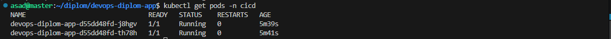
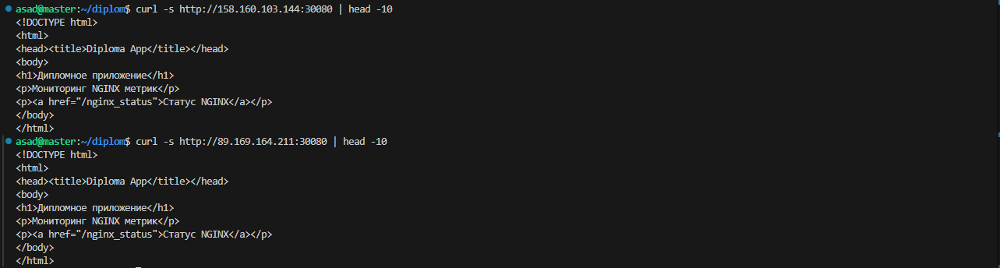
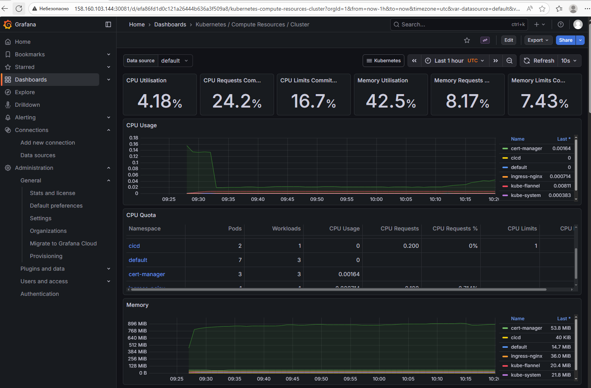
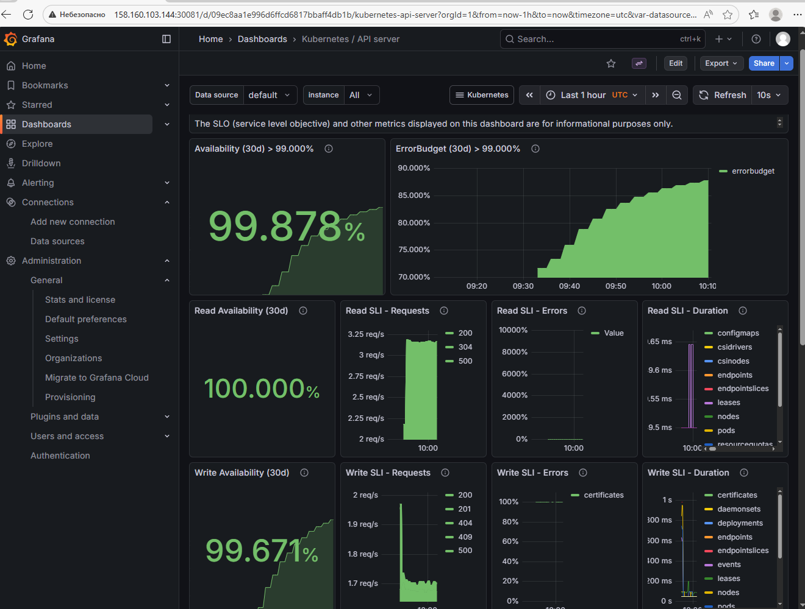
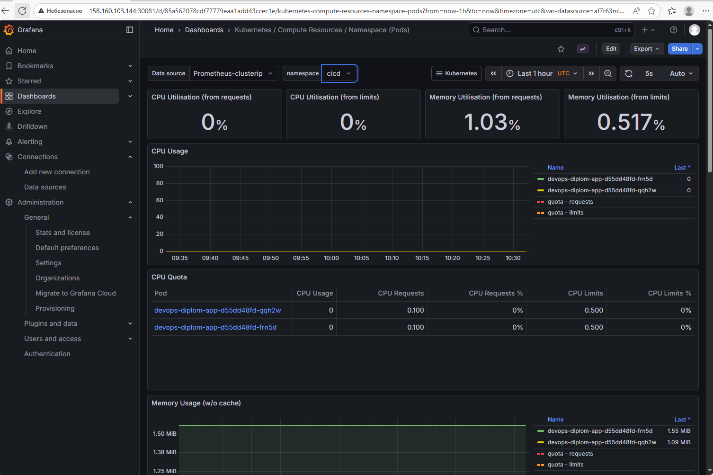
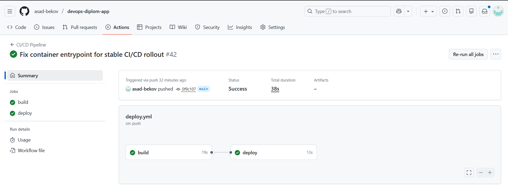

# DevOps Diploma Application

## Описание
Данный репозиторий содержит тестовое веб-приложение, развернутое в Kubernetes-кластере в рамках дипломного проекта DevOps (Netology).

Приложение демонстрирует:
- Контейнеризацию приложений
- Автоматизированный CI/CD pipeline
- Деплой в Kubernetes
- Мониторинг с использованием Prometheus и Grafana

Приложение представляет собой простой HTTP-сервис на базе Nginx, отдающий статические HTML-страницы.

## Быстрый старт

### Предварительные требования
- Доступ к Yandex Cloud с настроенными сервисными аккаунтами
- Настроенный Kubernetes кластер (min 3 ноды)
- Установленные: kubectl, docker, git

---

## Контейнеризация
Контейнеризация приложения выполняется с помощью Docker.

**Dockerfile:**
- Расположен в корне репозитория
- Использует образ `nginx:alpine` как базовый
- Копирует статические файлы в `/usr/share/nginx/html/`
- Экспонирует порт 80
- Содержит health-check endpoint `/health`

**Особенности сборки:**
- Сборка образа выполняется автоматически в CI/CD pipeline
- Образ публикуется в Yandex Container Registry (YCR)
- Для каждого коммита создается уникальный тег на основе SHA
- Для ветки main дополнительно публикуется тег `latest`

**Формат имен образов:**
```
cr.yandex/crplsrum4vurc408russ/devops-diplom-app:<tag>
```
Где `<tag>` может быть:
- `latest` - для main ветки
- `v1.0.0` - для версионных тегов  
- `a1b2c3d` - хеш коммита
---

## Деплой в Kubernetes
Приложение разворачивается в выделенном Kubernetes namespace `cicd`.

**Используемые ресурсы Kubernetes:**

1. **Namespace**: `cicd` - изоляция окружения CI/CD
2. **Deployment**:
   - 2 реплики для обеспечения отказоустойчивости
   - Настройки ресурсов (limits/requests)
   - Liveness и Readiness пробы
   - imagePullSecret для доступа к приватному registry
3. **Service (NodePort)**:
   - Тип: NodePort для прямого доступа
   - Порт: 30080 на нодах кластера
   - Селектор по labels: `app: devops-diplom-app`
4. **Ingress**:
   - Контроллер: ingress-nginx
   - Правила маршрутизации HTTP трафика
   - Host определяется динамически (nip.io) и используется для тестового доступа без DNS.

**Расположение манифестов:**

```
manifests/
├── deployment.yaml # Конфигурация развертывания
├── service.yaml # Сервис для доступа к подам
└── ingress.yaml # Внешний доступ через Ingress
```

**Команды для ручного развертывания:**
```bash
# Применение всех манифестов
kubectl apply -f manifests/

# Проверка статуса
kubectl get all -n cicd
kubectl describe deployment devops-diplom-app -n cicd
```
---

## CI/CD (GitHub Actions)

**Workflow файл:** `.github/workflows/deploy.yml`

**Триггеры запуска:**
- Push в ветку `main`
- Создание тега формата `v*.*.*`

**Основные шаги pipeline:**

1. **Checkout** - получение кода из репозитория
2. **Build & Push**:
   - Сборка Docker образа
   - Публикация в Yandex Container Registry
   - Тегирование образа (SHA, latest для main)
3. **Deploy**:
   - Настройка доступа к Kubernetes (kubeconfig)
   - Применение манифестов из папки `manifests/`
   - Rolling update через `kubectl set image`

**Особенности реализации:**
- Используется self-hosted GitHub Actions runner на master-ноде Kubernetes кластера
- Для обновления приложения применяется стратегия rolling update без downtime
- Все чувствительные данные хранятся в GitHub Secrets
- Runner имеет прямой доступ к кластеру через kubeconfig

**Используемые GitHub Secrets:**
- `YC_SA_KEY` - ключ сервисного аккаунта Yandex Cloud (JSON формат)
- `KUBE_CONFIG_DATA` - kubeconfig файл в base64 кодировке
- `YC_REGISTRY_ID` - идентификатор Container Registry в Yandex Cloud

**Ссылка на workflow:** [GitHub Actions](https://github.com/asad-bekov/devops-diplom-app/actions/workflows/deploy.yml)

---

## Проверка доступности приложения
После успешного деплоя приложение доступно:
- по NodePort-сервису
- через Ingress

Доступность приложения проверена с помощью `curl`,
что подтверждает корректную работу сервиса.

---

## Мониторинг

**Установленный стек мониторинга:**
- **Prometheus** - сбор метрик кластера и приложений
- **Grafana** - визуализация метрик и дашборды
- **kube-state-metrics** - метрики состояния Kubernetes объектов
- **node-exporter** - метрики физических/виртуальных нод

**Ключевые метрики для приложения:**
- Использование CPU и Memory подами
- Количество запущенных реплик
- HTTP availability (uptime)
- Response time

**Доступ к Grafana:**
```bash
# Получение пароля администратора
kubectl get secret -n monitoring kube-prometheus-stack-grafana \
  -o jsonpath="{.data.admin-password}" | base64 -d

# URL доступа: http://<master-node-ip>:30081
# Логин: admin
# Пароль: <полученный_выше>
```
---

*Данные меры и рекомендации приведены в рамках учебного дипломного проекта
и не претендуют на полноту production-решения.*

**Принятые меры безопасности:**

1. **Изоляция окружений**:
   - Приложение развернуто в отдельном namespace `cicd`
   - CI/CD runner изолирован на master-ноде

2. **Управление доступом**:
   - Service Account с минимально необходимыми правами
   - GitHub Secrets для хранения чувствительных данных
   - Kubeconfig с токеном ограниченного срока действия

3. **Безопасность образов**:
   - Использование официального образа nginx:alpine
   - Регулярное обновление базовых образов
   - Приватный Container Registry (Yandex Container Registry)

4. **Защита приложения**:
   - Настроены Liveness и Readiness пробы
   - Ограничения ресурсов (resource limits)
   - Health check endpoint

**Рекомендации для production-окружения:**
- Внедрение Network Policies
- Сканирование образов на уязвимости (Trivy, Clair)
- Использование Private Container Registry с доступом по IAM
- Настройка RBAC с принципом минимальных привилегий

## Ссылки на связанные репозитории

1. **Инфраструктура** - Terraform конфигурации для Yandex Cloud
   - [devops-diplom-infra](https://github.com/asad-bekov/devops-diplom-infra)

2. **Kubernetes конфигурации** - манифесты для мониторинга, ingress
   - [devops-diplom-k8s](https://github.com/asad-bekov/devops-diplom-k8s)

## Лицензия
Проект распространяется под лицензией MIT. Подробнее см. в файле [LICENSE](LICENSE).

## Скриншоты
Скриншоты работы приложения, CI/CD и мониторинга расположены в каталоге `screenshots/`

### Kubernetes cluster и namespace cicd

Общий обзор Kubernetes-кластера и ресурсов,
используемых приложением в namespace `cicd`.


---

### Приложение в Kubernetes

Состояние pod'ов приложения `devops-diplom-app`
в namespace `cicd`.



Service и Ingress, используемые для доступа к приложению.


Проверка используемого Docker-образа в Deployment.


---

### Проверка доступности приложения

Проверка доступности приложения по внутреннему и внешнему адресу
с помощью `curl`.



---

### Мониторинг приложения и кластера

Grafana dashboard с общим обзором ресурсов Kubernetes-кластера.



Метрики Kubernetes API Server.



Использование ресурсов pod'ов приложения в namespace `cicd`.



---

### CI/CD pipeline

Успешный запуск CI/CD pipeline GitHub Actions,
выполняющего сборку и деплой приложения.




